```
(\ (\
( • •)  
━∪∪━━━━ 
ᵇʸ ᴬˡᵉᶠᵘᵉⁿᵗᵉˢ
```
# SPRING | Múltiples Brokers
      


Este proyecto es una aplicación fullstack (Java/Angular) de ejemplo que demuestra uan arquitectura moderna y desacoplada para un sistema de gestion de notificaciones.

El objetivo principal es servir a un laboratorio práctico (hands-on lab) para entender y comparar la integración de `ActiveMQ`, `RabbitMQ` y `Kafka` en un ecosistema de Sprint Boot y Angular.

## Arquitectura del proyecto

El flujo de datos es la siguiente

1. frontend | angular : el usuário interactua con la interfaz web para escribir una notifición.
2. API REST | spring boot : recibe la solicitación POST del frontend.
3. Lógica de Negócio | sprint boot : <br>
    -> `NotificacionController` recibe la solicitacion <br>
    -> `NotificacionService` persiste los datos en PostgreSQL <br>
    -> inmediatamente después, se envia a los 3 brokes (producers) `ActiveMQ`, `RabbitMQ` y `Kafka`. 
4. Consumer | spring boot : los responsábles de escuchar o consumir los mensajes, imprimen en la consola del backend.

```mermaid
graph TD
    %% Definición de Nodos
    U["<br/>🙋‍♂️<br/>Usuario"]
    A["<b>Angular Frontend</b><br/>http://localhost:4200"]
    C["API Controller<br/>(NotificationController)"]
    S["Servicio<br/>(NotificationService)"]
    DB[("🐘<br/>PostgreSQL")]
    P["Productores de Mensajes<br/>(Templates)"]
    WS_Broker["<br/>⚡️<br/>WebSocket Broker<br/>(STOMP en Memoria)"]
    B1{"📦<br/>ActiveMQ"}
    B2{"🐰<br/>RabbitMQ"}
    B3{"⚫<br/>Kafka"}
    CON["Consumidores de Mensajes<br/>(@Listeners)"]
    LOGS["<br/>📝<br/>Consola del Backend"]
    
    %% Agrupación en Subgrafos
    subgraph "Frontend"
        A
    end

    subgraph "Backend - Spring Boot"
        C --> S
        S --> DB
        S -- "3. Publica Eventos" --> P
        P -- "3a. Envía a cola" --> B1
        P -- "3b. Envía a cola" --> B2
        P -- "3c. Envía a topic" --> B3
        B1 & B2 & B3 --> CON
        CON -- "Imprime Logs" --> LOGS
        
        S -- "4. Empuja a WebSocket" --> WS_Broker
    end

    subgraph "Infraestructura (Docker & En Memoria)"
        DB
        B1
        B2
        B3
        WS_Broker
    end
    
    %% Flujo de la Aplicación
    U -- "Interactúa" --> A
    
    A -- "1. Petición POST REST" --> C
    C -- "2. Responde 200 OK" --> A
    
    A <-.->|Establece Conexión WebSocket| WS_Broker
    WS_Broker -- "5. Notificación en Tiempo Real" --> A
```




## Utilizar el proyecto

1- clonar el proyecto en su ambiente local
```bash
git clone https://github.com/ale-fuentes-ar/interview-spring-multibrokers.git
cd interview-spring-multibrokers
```

2- levantar las instancias dockers
```bash
docker-compose up -d
```

3- ejecutar el backend.
> ☕︎ `-DskipTests` para evitar ejecutar la fase de pruebas que requiere un entorno específico.
```bash
cd notification-service
./mvnw spring-boot:run -DskipTests
```

4- ejecutar el frontend
> ☕︎ `--legacy-peer-deps` debido a la diferencia de versiones entre el proyecto Angular antiguo y un posible Node.js mas moderno.
```bash
cd notification-front
npm install --legacy-peer-deps
ng serve
```

5- testar 

* Abre tu navegador y ve a http://localhost:4200.
* Escribe un mensaje en el campo de texto y haz clic en "Enviar Notificación".
* Observa el frontend: Tu mensaje aparecerá en la lista.
* Observa la consola del backend: Verás los tres mensajes de los consumidores, confirmando que el ciclo completo ha funcionado.

6- para finalizar las instancias dockers.
```bash
docker-compose down
```


## Mejorias pendientes

Siguientes Pasos (Para seguir mejorando)

- [ ] Seguridad: Añadir Spring Security y JWT para proteger tus endpoints.
- [x] WebSockets: En lugar de recargar la lista de notificaciones manualmente, podrías usar WebSockets (con STOMP sobre RabbitMQ/ActiveMQ) para que las notificaciones aparezcan en tiempo real en el frontend.
- [ ] Manejo de Errores: Implementar un manejo de errores más robusto tanto en el frontend como en el backend.
- [ ] Tests: Escribir tests unitarios y de integración.
- [ ] Patrones de Mensajería más complejos: Investigar patrones como Request/Reply o Fanout.