```
(\ (\
( • •)  
━∪∪━━━━ 
ᵇʸ ᴬˡᵉᶠᵘᵉⁿᵗᵉˢ
```
# SPRING | Múltiples Brokers
   |
   |    


Este proyecto es una aplicación fullstack (Java/Angular) de ejemplo que demuestra uan arquitectura moderna y desacoplada para un sistema de gestion de notificaciones.

El objetivo principal es servir a un laboratorio práctico (hands-on lab) para entender y comparar la integración de `ActiveMQ`, `RabbitMQ` y `Kafka` en un ecosistema de Sprint Boot y Angular.

## Arquitectura del proyecto

El flujo de datos es la siguiente

1. frontend | angular : el usuário interactua con la interfaz web para escribir una notifición.
2. API REST | spring boot : recibe la solicitación POST del frontend.
3. Lógica de Negócio | sprint boot : <br>
    -> `NotificacionController` recibe la solicitacion <br>
    -> `NotificacionService` persiste los datos en PostgreSQL <br>
    -> inmediatamente después, se envia a los 3 brokes (producers) `ActiveMQ`, `RabbitMQ` y `Kafka`. 
4. Consumer | spring boot : los responsábles de escuchar o consumir los mensajes, imprimen en la consola del backend.

```mermaid
graph TD
    %% Definición de Nodos
    U["<br/>🙋‍♂️<br/>Usuario"]
    A["<b>Angular Frontend</b><br/>http://localhost:4200"]
    C["API Controller<br/>(NotificationController)"]
    S["Servicio<br/>(NotificationService)"]
    DB[("🐘<br/>PostgreSQL")]
    P["Productores de Mensajes<br/>(Templates)"]
    WS_Broker["<br/>⚡️<br/>WebSocket Broker<br/>(STOMP en Memoria)"]
    B1{"📦<br/>ActiveMQ"}
    B2{"🐰<br/>RabbitMQ"}
    B3{"⚫<br/>Kafka"}
    CON["Consumidores de Mensajes<br/>(@Listeners)"]
    LOGS["<br/>📝<br/>Consola del Backend"]
    
    %% Agrupación en Subgrafos
    subgraph "Frontend"
        A
    end

    subgraph "Backend - Spring Boot"
        C --> S
        S --> DB
        S -- "3. Publica Eventos" --> P
        P -- "3a. Envía a cola" --> B1
        P -- "3b. Envía a cola" --> B2
        P -- "3c. Envía a topic" --> B3
        B1 & B2 & B3 --> CON
        CON -- "Imprime Logs" --> LOGS
        
        S -- "4. Empuja a WebSocket" --> WS_Broker
    end

    subgraph "Infraestructura (Docker & En Memoria)"
        DB
        B1
        B2
        B3
        WS_Broker
    end
    
    %% Flujo de la Aplicación
    U -- "Interactúa" --> A
    
    A -- "1. Petición POST REST" --> C
    C -- "2. Responde 200 OK" --> A
    
    A <-.->|Establece Conexión WebSocket| WS_Broker
    WS_Broker -- "5. Notificación en Tiempo Real" --> A
```




## Utilizar el proyecto

1- clonar el proyecto en su ambiente local
```bash
git clone https://github.com/ale-fuentes-ar/interview-spring-multibrokers.git
cd interview-spring-multibrokers
```

2- levantar las instancias dockers
```bash
docker-compose up -d
```

3- ejecutar el backend.
> ☕︎ `-DskipTests` para evitar ejecutar la fase de pruebas que requiere un entorno específico.
```bash
cd notification-service
./mvnw spring-boot:run -DskipTests
```

4- ejecutar el frontend
> ☕︎ `--legacy-peer-deps` debido a la diferencia de versiones entre el proyecto Angular antiguo y un posible Node.js mas moderno.
```bash
cd notification-front
npm install --legacy-peer-deps
ng serve
```

5- testar 

* Abre tu navegador y ve a http://localhost:4200.
* Escribe un mensaje en el campo de texto y haz clic en "Enviar Notificación".
* Observa el frontend: Tu mensaje aparecerá en la lista.
* Observa la consola del backend: Verás los tres mensajes de los consumidores, confirmando que el ciclo completo ha funcionado.

6- para finalizar las instancias dockers.
```bash
docker-compose down
```


## Mejorias pendientes

Siguientes Pasos (Para seguir mejorando)

- [x] Seguridad: Añadir Spring Security y JWT para proteger tus endpoints.
- [x] WebSockets: En lugar de recargar la lista de notificaciones manualmente, podrías usar WebSockets (con STOMP sobre RabbitMQ/ActiveMQ) para que las notificaciones aparezcan en tiempo real en el frontend.
- [x] Redis: Incluir cache.
- [x] Manejo de Errores: Implementar un manejo de errores más robusto tanto en el frontend como en el backend.
- [x] Tests: Escribir tests unitarios y de integración.
- [x] Swagger: Documentar API. 
- [ ] Patrones de Mensajería más complejos: Investigar patrones como Request/Reply o Fanout.

### Spring Security | JWT para proteger mis endpoints


### WebSocket | Replicar en tiempo real

```mermaid
sequenceDiagram
    participant FE as Frontend (Angular)
    participant BE as Backend (Spring Boot)
    
    Note over FE,BE: Fase 1: Establecimiento de la Conexión
    FE->>BE: 1. Petición HTTP para iniciar conexión WebSocket (/ws)
    BE-->>FE: 2. Conexión WebSocket establecida (canal abierto)

    Note over FE,BE: Fase 2: Suscripción a un Tópico
    FE->>BE: 3. Envía mensaje STOMP: SUBSCRIBE a /topic/notifications
    Note right of BE: El Backend registra la suscripción del cliente.
    
    %% -- Un evento ocurre en otro momento -- %%
    
    participant User2 as Otro Usuario
    participant FE2 as Otro Frontend
    
    Note over FE2,BE: Fase 3: Un evento dispara la notificación
    User2->>FE2: 4. Envía una nueva notificación (vía API REST)
    FE2->>BE: 5. Petición POST /api/notifications
    
    BE->>BE: 6. Procesa la petición (Guarda en BD, etc.)
    
    Note over FE,BE: Fase 4: El Servidor "Empuja" (Push) la Notificación
    BE-->>FE: 7. PUSH! Envía mensaje STOMP con la nueva<br/>notificación a /topic/notifications
    
    Note left of FE: El Frontend recibe la notificación y<br/>actualiza la UI en tiempo real.
```



### Redis | Cache

Permite aliviar el acesso al banco de datos, almacenando consultas previas en una region de cache.

```mermaid
sequenceDiagram
    participant FE as Frontend (Angular)
    participant BE as Backend (Spring Boot)
    participant RC as Cache (Redis)
    participant DB as Base de Datos (PostgreSQL)

    FE->>BE: 1. Petición GET /api/notifications
    
    BE->>RC: 2. ¿Existe la clave 'notifications'?
    
    alt Acierto de Caché (Cache Hit)
        RC-->>BE: 3a. Sí, aquí están los datos.
        BE-->>FE: 4a. Devuelve datos cacheados (¡Rápido!)
    else Fallo de Caché (Cache Miss)
        RC-->>BE: 3b. No, no tengo esos datos.
        BE->>DB: 4b. Consulta a la base de datos (SELECT *)
        DB-->>BE: 5b. Devuelve la lista de notificaciones.
        BE->>RC: 6b. Guarda el resultado en la caché.
        BE-->>FE: 7b. Devuelve datos desde la BD.
    end
```



### Manejo de errores

El objetivo es:
- Centralizar el manejo de excepciones en el backend.
- Devolver siempre una respuesta JSON clara y consistente cuando ocurra un error, con un código de estado HTTP apropiado.
- Hacer que el frontend pueda leer esta respuesta y mostrar un mensaje más amigable al usuario.

### Tests | Escribir tests unitarios y de integración

Importancia sobre el uso de testes:

- Construir una Red de Seguridad: Los tests verifican que el código que ya hemos escrito funciona como se espera. Esto nos da una "red de seguridad" que nos permite añadir nuevas funcionalidades (como los patrones de mensajería complejos) o refactorizar el código existente con la confianza de que no hemos roto nada.
- Documentación Viva: Un buen conjunto de tests sirve como documentación. Cualquiera puede leerlos y entender qué se espera que haga cada parte de la aplicación.
- Facilita la Depuración: Cuando un test falla, te señala exactamente qué parte del código se ha roto, haciendo que encontrar y arreglar bugs sea mucho más rápido.


### Swagger | Documentación de las API

**Modelo conceptual** sobre que hace el `swagger`:

```mermaid
graph TD
    subgraph "Desarrollador Backend"
        A["<b>Código Spring Boot</b><br>@RestController, @GetMapping, etc."]
    end

    subgraph "Proceso de Build/Arranque"
        B(<b>Librería springdoc-openapi</b>)
    end
    
    subgraph "Aplicación en Ejecución"
        C{"<b>Especificación OpenAPI</b><br>Generada en JSON<br><i>/v3/api-docs</i>"}
        D["<b>Swagger UI</b><br>Página web interactiva<br><i>/swagger-ui.html</i>"]
    end

    subgraph "Usuarios de la API"
        E["Desarrollador Frontend"]
        F["Tú mismo (Tester)"]
    end

    A -- "Es escaneado por" --> B
    B -- "Genera automáticamente" --> C
    C -- "Es renderizada por" --> D
    
    D -- "Es consultada y usada por" --> E
    D -- "Es usada para probar por" --> F
```



**Flujo de prueba con seguridad activa**, para la comprensión de como utilizar el teste en endpoints protegidos:

```mermaid
sequenceDiagram
    participant Dev as Desarrollador/Tester
    participant UI as Swagger UI (Navegador)
    participant BE as Backend (API)

    Note over Dev,BE: Fase 1: Obtener el Token de Autenticación

    Dev->>UI: 1. Ejecuta POST /api/auth/authenticate (con usuario/pass)
    UI->>BE: 2. Envía la petición de login
    BE-->>UI: 3. Devuelve el Token JWT
    UI-->>Dev: 4. Muestra el token en la respuesta
    
    Dev->>Dev: 5. Copia el token JWT

    Note over Dev,UI: Fase 2: "Iniciar Sesión" en Swagger UI

    Dev->>UI: 6. Haz clic en "Authorize"
    Dev->>UI: 7. Pega el token en el campo "Bearer Auth"
    Note right of UI: Swagger UI ahora guardará este<br>token para futuras peticiones.

    %% --- Fase 3: Probar un Endpoint Protegido ---
    
    Note over Dev,BE: Fase 3: Probar un Endpoint Protegido

    Dev->>UI: 8. Ejecuta GET /api/notifications
    
    UI->>BE: 9. Envía la petición GET, pero ahora incluye<br>la cabecera "Authorization: Bearer <token>"
    
    Note right of BE: Spring Security intercepta, valida el token y<br>permite el acceso.
    
    BE-->>UI: 10. Devuelve la respuesta 200 OK con los datos
    UI-->>Dev: 11. Muestra la respuesta exitosa
```


