```
(\ (\
( • •)  
━∪∪━━━━ 
ᵇʸ ᴬˡᵉᶠᵘᵉⁿᵗᵉˢ
```
# SPRING | Múltiples Brokers
     


Este proyecto es una aplicación fullstack (Java/Angular) de ejemplo que demuestra uan arquitectura moderna y desacoplada para un sistema de gestion de notificaciones.

El objetivo principal es servir a un laboratorio práctico (hands-on lab) para entender y comparar la integración de `ActiveMQ`, `RabbitMQ` y `Kafka` en un ecosistema de Sprint Boot y Angular.

```mermaid
graph TD
    %% Definición de Nodos
    U["<br/>🙋‍♂️<br/>Usuario"]
    A["<b>Angular Frontend</b><br/>http://localhost:4200"]
    C["API Controller<br/>(NotificationController)"]
    S["Servicio<br/>(NotificationService)"]
    P["Productores de Mensajes<br/>(Templates)"]
    CON["Consumidores de Mensajes<br/>(@Listeners)"]
    LOGS["<br/>📝<br/>Consola del Backend"]
    DB[("🐘<br/>PostgreSQL")]
    B1{"📦<br/>ActiveMQ"}
    B2{"🐰<br/>RabbitMQ"}
    B3{"⚫<br/>Kafka"}

    subgraph "Frontend"
        A
    end

    subgraph "Backend - Spring Boot"
        C --> S
        S --> P
        S --> DB
        P --> B1
        P --> B2
        P --> B3
    end

    subgraph "Infraestructura (Docker)"
        DB
        B1
        B2
        B3
    end
    
    %% Flujo de la Aplicación
    U -- "Interactúa" --> A
    A -- "1. Petición POST" --> C
    
    B1 -- "4a. Lee de cola" --> CON
    B2 -- "4b. Lee de cola" --> CON
    B3 -- "4c. Lee de topic" --> CON
    
    CON -- "5. Imprime log" --> LOGS
```




## Subiendo los contenedores Docker

para subir las instancias dockers
```bash
docker-compose up -d
```

para finalizar las instancias dockers.
```bash
docker-compose down
```

## Verificar los contenedores

### Testando container | POSTGRES
Verificar los logs
```bash
docker-compose logs postgres
```
Verificar desde dentro del contenedor 
```
# verificar el nombre del contenedor postgres -> ho-sp-db-postgres
docker ps

# conectar al contenedor
docker -it ho-sp-db-postgres psql -U admin -d ho-sp-db-sc-notification
```

> ☕︎ explicando el comando: <br>
> `docker exec`: Ejecuta un comando en un contenedor en ejecución. <br>
> `-it`: Modos interactivo (-i) y TTY (-t), que te permiten interactuar con el comando. <br>
> `ho-sp-db-postgres`: El nombre de nuestro contenedor. <br>
> `psql -U admin -d ho-sp-db-sc-notification`: El comando a ejecutar dentro del contenedor.<br>
> * `psql` es el cliente, 
> * `-U admin` especifica el usuario y 
> * `-d ho-sp-db-sc-notification` especifica la base de datos a la que te quieres conectar. <br>


### Testando container | ACTIVEMQ

Verificar los logs
```bash
docker-compose logs activemq
```
Verificar desde dentro del contenedor 
```
# verificar el nombre del contenedor activemq -> ho-sp-broker-activemq
docker ps
```
Si esta todo bien, podemos utilizar la url `http://localhost:8161`

> ☕︎ al tentar usar el teste via http, te pedirá un usuario y una contraseña. Para la imagen de Docker que estamos usando (rmohr/activemq), las credenciales por defecto son: <br> 
> * Usuario: admin
> * Contraseña: admin

### Testando container | KAFKA

> ☕︎ en versiones mas actuales no será utilizado ZooKeeper

Kafka utiliza en su arquitectura para gestion el ZooKeeper, es por eso que al testar KAFKA, verificaremos el Zookeeper esté ejecutado.

**Testando Zookeeper**
```bash
# verificar el log
docker-compose logs zookeeper

# conectar a la consola zookeeper
docker exec -it ho-sp-broker-zookeeper zookeeper-shell localhost:2181
```

> ☕︎ dentro de la consola se puede ejecutar el comando `ls /` para ver todos los directorios creados

**Testando Kafka**

```bash
# verificar el contenedor de kafka
docker-compose ps

# verificar el log
docker-compose logs kafka
```

Para testar `producer` y `consumer` en kafka

en el primer bash (bash-1), ejectuar :
```bash
# conectar a um `producer`
docker exec -it ho-sp-broker-kafka //usr/bin/kafka-console-producer --bootstrap-server localhost:29092 --topic notification.topic
```

en otro bash (bash-2), ejectuar :
```bash
# conectar a um `consumer`
docker exec -it ho-sp-broker-kafka //usr/bin/kafka-console-consumer --bootstrap-server localhost:29092 --topic notification.topic
```

para testar escribir un mensage en el bash-1, y debera reflectirse en el bash-2.

